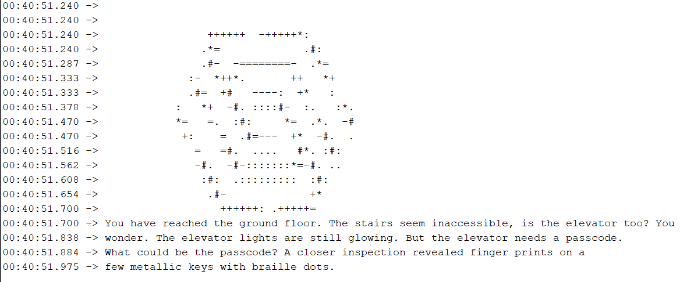
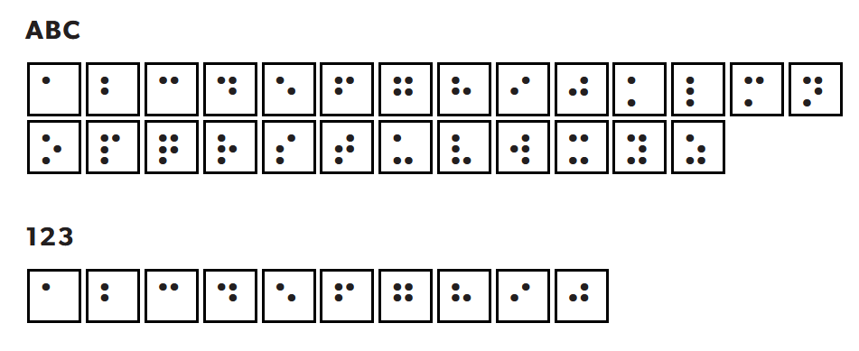
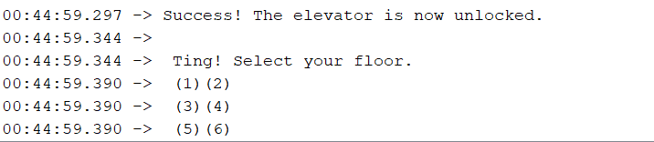

After connecting the board to the system and activating the CTF, the challenge begins!

The challenge begins with the following:

`You have reached the ground floor. The stairs seem inaccessible, is the elevator too? You wonder. The elevator lights are still glowing. But the elevator needs a passcode. What could be the passcode? A closer inspection revealed finger prints on a few metallic keys with braille dots.`

braille? Where are the dots?

A quick check on the board yield's no results.

What about the lanyard? Voila! The dots are conveniently placed throughout the lanyard.

Using the [decoder](https://twoblindbrothers.com/pages/braille) 

We got the answer: **368078**

Entering this will trigger the lift, and are the same for the challenges that follows until the challenge is over:

`Success! The elevator is now unlocked.  
Ting! Select your floor.  
(1)(2)  
(3)(4)  
(5)(6)`
