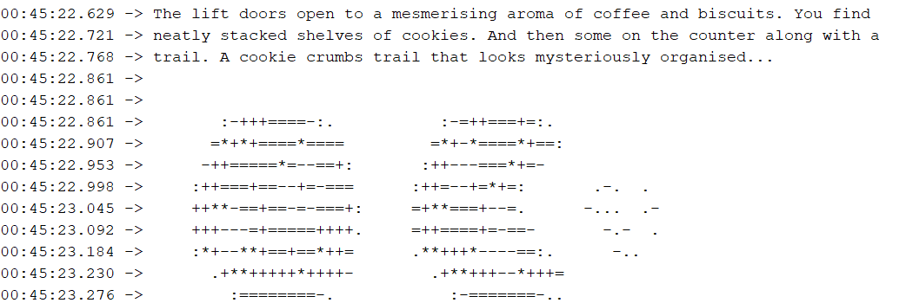

After completing challenge 1, we move onto challenge 2 by typing `1` into the serial monitor.

`The lift doors open to a mesmerising aroma of coffee and biscuits. You find neatly stacked shelves of cookies. And then some on the counter along with a trail. A cookie crumbs trail that looks mysteriously organised...`

This challenge is a simple morse code. 

Once you figure the morse code out, the answer is simply:
**rebaked**
