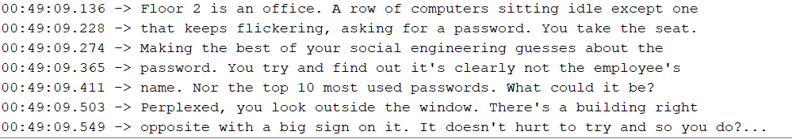
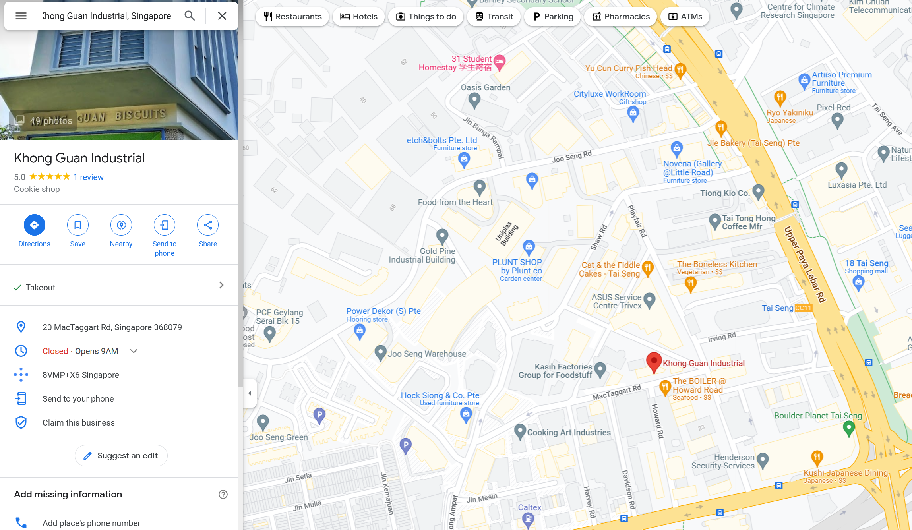

After completing challenge 2, we move onto challenge 3 by typing `2` into the serial monitor.

`Floor 2 is an office. A row of computers sitting idle except one that keeps flickering, asking for a password. You take the seat. Making the best of your social engineering guesses about the password. You try and find out it's clearly not the employee's name. Nor the top 10 most used passwords. What could it be? Perplexed, you look outside the window. There's a building right opposite with a big sign on it. It doesn't hurt to try and so you do?...`

In this case, OSINT challenge has pretty much began. So since this challenge is talking about the building, we first have to find the Khong Guan building that is shown on the badge, where we are "currently" at.

Using google search we find in around paya laber area:

Followingwhich, we use google street view and orientate ourselves to see what building we might see from the window, and their signs.

And voila! There it is!

Answer: **trivex**
