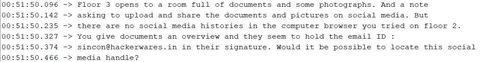
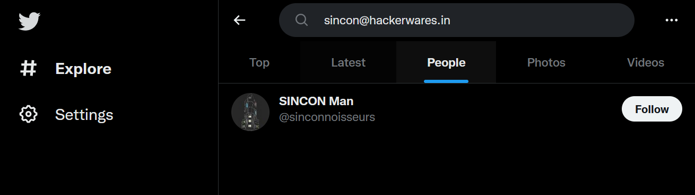

After completing challenge 3, we move onto challenge 4 by typing `3` into the serial monitor.

`Floor 3 opens to a room full of documents and some photographs. And a note asking to upload and share the documents and pictures on social media. But there are no social media histories in the computer browser you tried on floor 2. You give documents an overview and they seem to hold the email ID : sincon@hackerwares.in in their signature. Would it be possible to locate this social media handle?`

Without using any tools, we can search for emails on twitter or facebook, lesser luck with instagram unfortunately.

In this case, I used twitter and got the answer.

Answer: **sinconnoisseurs**
