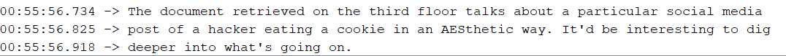

After completing challenge 4, we move onto challenge 5 by typing `4` into the serial monitor.

`The document retrieved on the third floor talks about a particular social media post of a hacker eating a cookie in an AESthetic way. It'd be interesting to dig deeper into what's going on.`

To find this, first scouring on Instagram using the handle from Challenge 4, we got a 'hacker' eating cookies with a weird long post description,

Considering that the clue is AESthetic, we believe that this is using AES encryption.

However, we need both the IV and key to decrypt it.

Since there was nothing else on twitter, we move our attention to facebook. 

Indeed, there was a post from the user saying that they are stealing from "sinconfectionery", abd we use that as the Key. 

How about the IV? After looking at other Social Media Channels and posts in vain, we realized it could be AES-ECB mode instead, IV was not neccessary!

Deciphering it now, with UTF-8 as the text format, we got the answer!

`Cookie eating? More like.... "cookie sniffing"`

Answer: **cookie sniffing**
