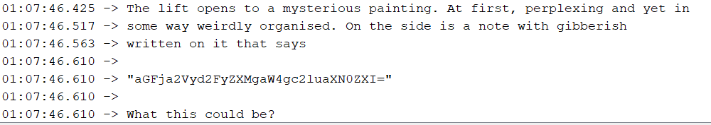
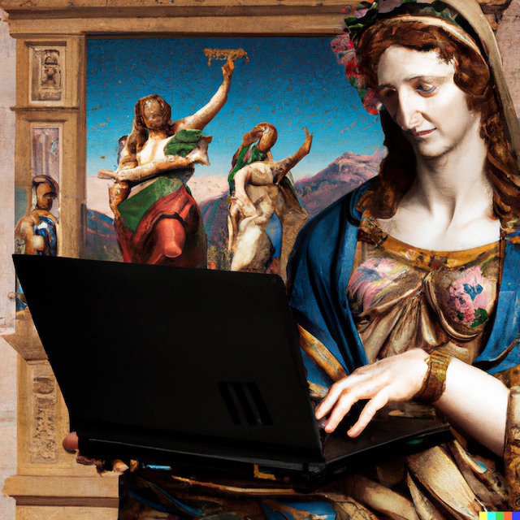
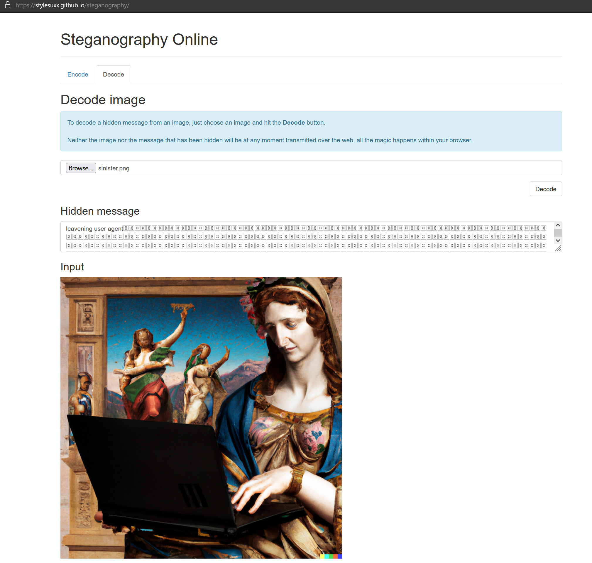

After completing challenge 5, we move onto challenge 6 by typing `5` into the serial monitor.

`The lift opens to a mysterious painting. At first, perplexing and yet in some way weirdly organised. On the side is a note with gibberish written on it that says
"aGFja2Vyd2FyZXMgaW4gc2luaXN0ZXI="
What this could be?`

Looking at the format of the encoded text, it is obviously a base64 encoding.

Reversing the encoding, we get: `hackerwares in sinister`

Hang on, this is not the right answer. That is weird...

The text says 'painting', could this be an image? And the other 2 words resembles to the challenge domain..

So now, we tried to access hackerwares.in looking for a file name 'sinister' in various image formats and we found it!
[sinister.png](hackerwares.in/sinister.png)

What can I do with this? Hmm, most likely stegnography or EXIF challenge from the looks of it!

First running a stegnography decoder to see if there is any hidden text, and indeed!

Answer: **leavening user agent**
