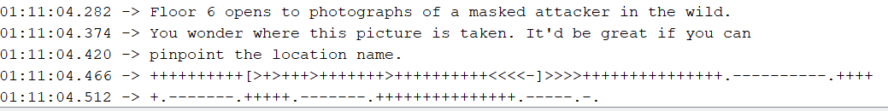
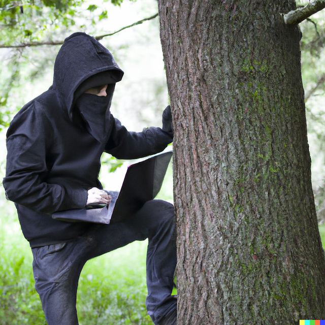
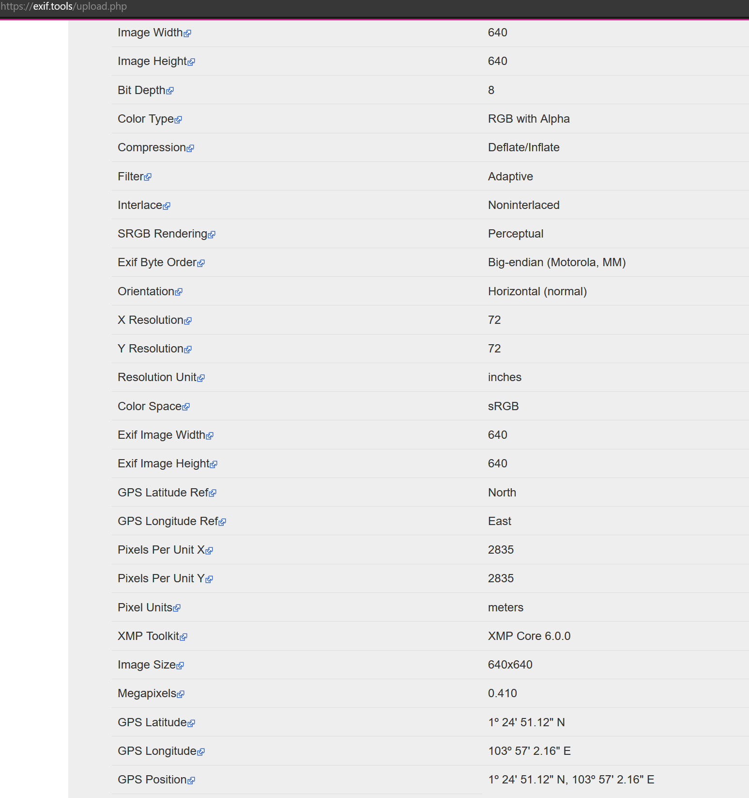
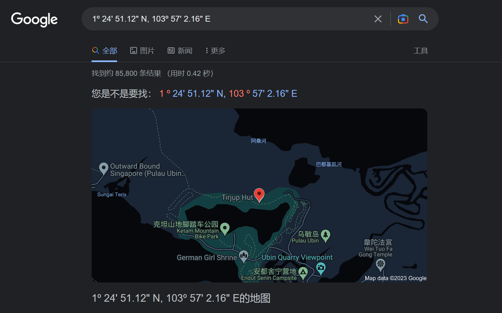
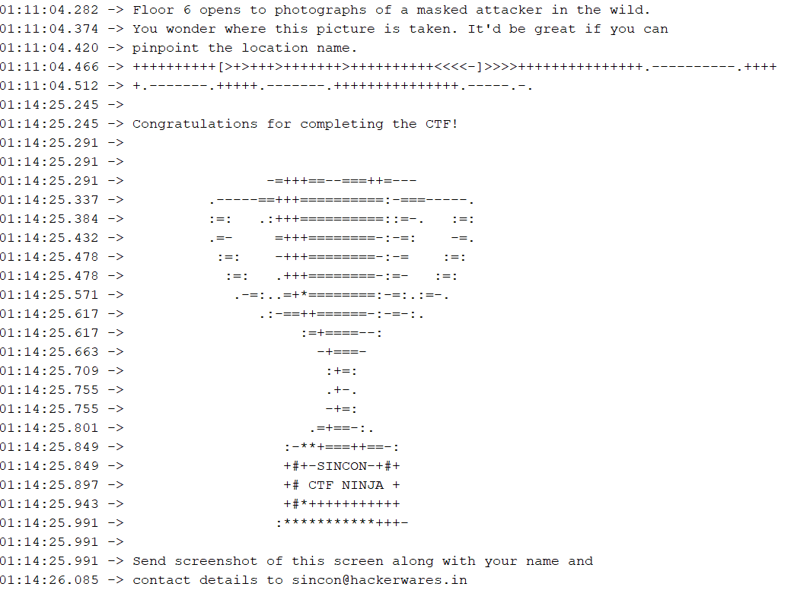

After completing challenge 6, we move onto to last and final challenge, challenge 7 by typing `6` into the serial monitor.

`Floor 6 opens to photographs of a masked attacker in the wild. You wonder where this picture is taken. It'd be great if you can pinpoint the location name.`

`++++++++++[>+>+++>+++++++>++++++++++<<<<-]>>>>+++++++++++++++.----------.+++++.-------.+++++.-------.+++++++++++++++.-----.-.`

Oh wow, what on earth is this?

So this is actually encoded with `brainfuck` language.

Using a translator, we get this decoded to: `singleton`

Again, like challenge 6, this is not the answer. What could it be?

The challenge states that this is an image just like challenge 6...

Using the same construct from challenge 6, we have: [singleton.png](hackerwares.in/singleton.png)

And since its an image, it is most likely a stegnography or EXIF challenge.

Pushing the image through reverse stegnography bore no results, so its time to check the basics since we are looking for a location, which means GPS - [EXIF](exif.tools).

And there is indeed GPS data!

Pushing this data directly into Google, we have finally have the location name!

Answer: **tirjup hut**

Finishing this challenge marks the end of the challenge with the following note:

Congrats!
