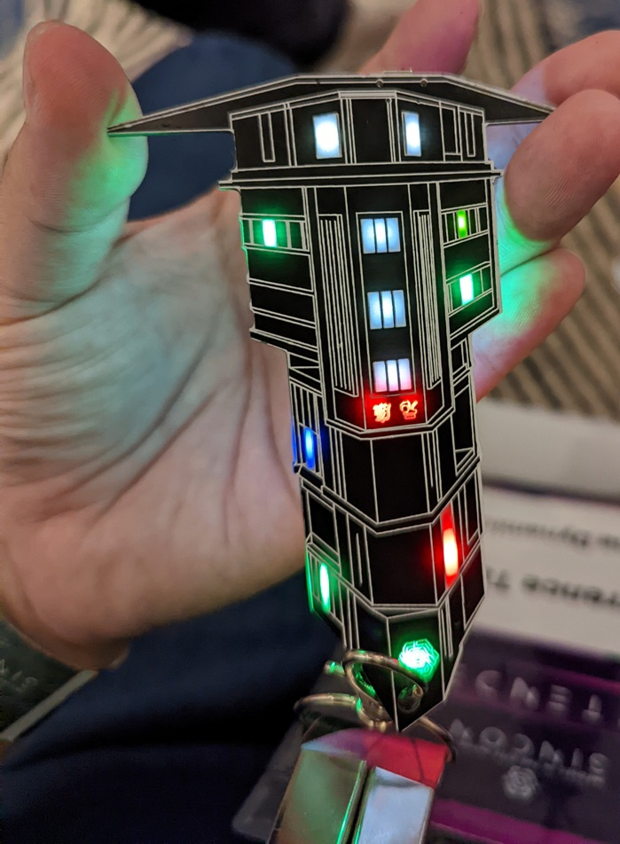
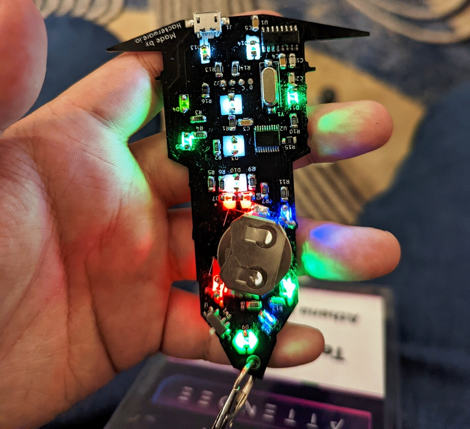

# SINCONReloadedHWCTF
SINCON Reloaded or SINCON 2023 concluded last week, which was conducted over 2 days - 5th and 6th of January 2023. All full access pass holders were entitled to an exclusive electronic hardware badge which included a mini CTF. Comprising of 7 challenges, after resolving each challenge, more LED lights were lighted upon the board, depending on which challenge you did.

The hardware CTF revolved around the story of SINCON's sponsor - Khong Guan Biscuits Limited, in which the beautiful electronic badge was (physically) designed against. 

The original board, once inserted with the CR2032 battery, looks and lights up with 3 LEDs as seen below:

The first thing to do, is to ensure that the board has the additional (10) LED lights soldered at the soldering station. The guide is available here (https://www.hackerwares.in/sincon.pdf) or [here](sincon soldering guide.pdf). Once soldered, it will look like this eventually:

Together with the board, an additional lanyard for it was provided (in addition to the standard name pass and lanyard):

Once completed, the board will be lighted up like this (actual color of light depends on what color LED you had soldered!):

