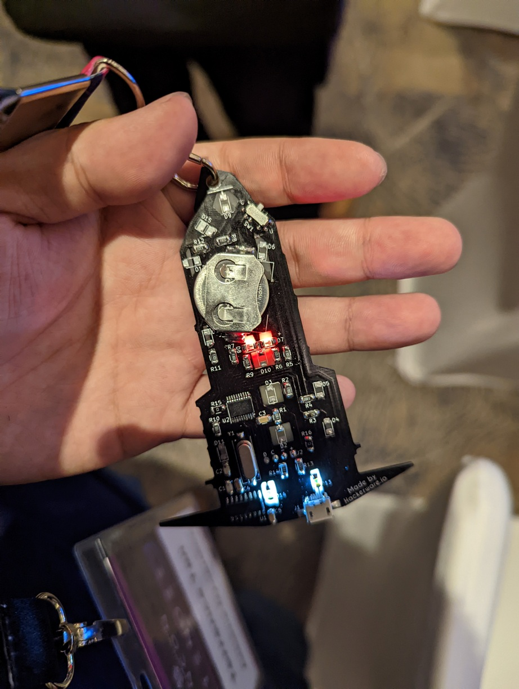

# SINCONReloadedHWCTF
SINCON Reloaded or SINCON 2023 concluded last week, which was conducted over 2 days - 5th and 6th of January 2023. All full access pass holders were entitled to an exclusive electronic hardware badge which included a mini CTF. Comprising of 7 challenges, after resolving each challenge, more LED lights were lighted upon the board, depending on which challenge you did.

The hardware CTF revolved around the story of SINCON's sponsor - Khong Guan Biscuits Limited, in which the beautiful electronic badge was (physically) designed against. 

The original board, once inserted with the CR2032 battery, looks and lights up with 3 LEDs as seen below:

The first thing to do, is to ensure that the board has the additional (10) LED lights soldered at the soldering station. The guide is available here (https://www.hackerwares.in/sincon.pdf) or [here](sincon soldering guide.pdf). Once soldered, it will look like this eventually:

Together with the board, an additional lanyard for it was provided (in addition to the standard name pass and lanyard):

To get started for the board, you will need to download the Arduino IDE. For some reason, the latest version doesnt play well with it, so you will need to use the legacy edition (v 1.8.19) instead. Arduino IDE can be downloaded from the official site - https://www.arduino.cc/en/software

Once downloaded and running, connect the e-badge board to the computer using a microUSB cable and follow the following steps:
 - Go to tools
 - Select USB
 - And select the correct USB device

To activate the serial monitor:

 - Go to tools
 - Select Serial Monitor
 - A command-like interface will pop up
 - On the right bottom corner change to the right settings: **Both NL & CR with 9600 baud**
 
 To get started once the setup is done:
 - send `***` in the serial monitor interface. The challenge should officially start.

Do note that **All flags are in lowercase without any brackets**
